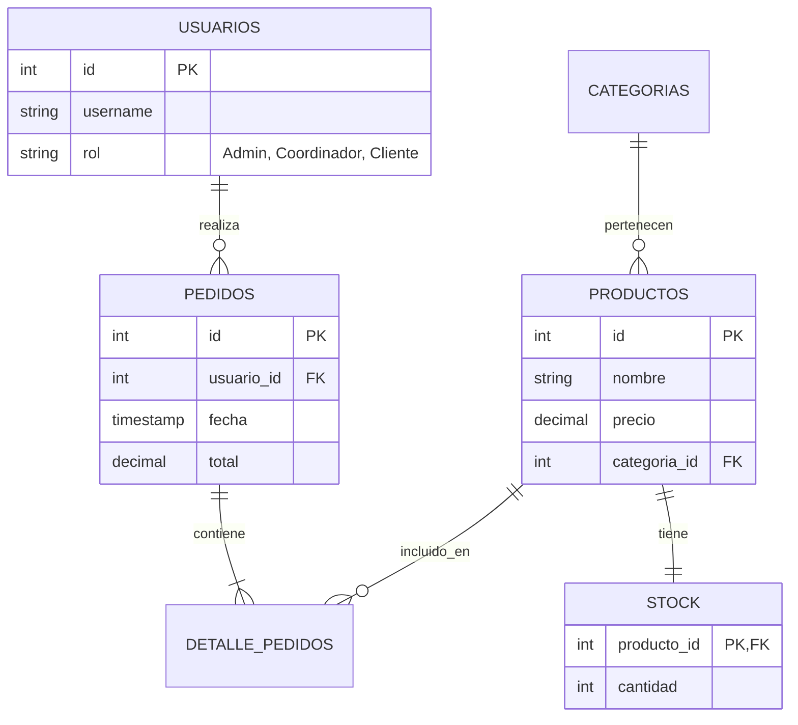

# 📊 Sistema Ecommerce - Módulo 5 (Base de Datos Relacional)

Este proyecto comprende el diseño e implementación de una base de datos relacional para un sistema de e-commerce, asegurando la integridad de los datos y la consistencia en las operaciones de compra.

## 🏗️ Modelo Entidad-Relación (ER)
Utilizamos Mermaid para representar las relaciones entre las entidades principales.

## 🛠️ Stack Tecnológico

Motor: PostgreSQL / Sistema Relacional.

Lenguaje: SQL (DDL, DML, TCL).

## 🚦 Orden de Ejecución de Scripts
Para garantizar que las llaves foráneas se creen y vinculen correctamente, siga este orden:

1. schema.sql: Define la estructura de tablas y restricciones (Checks de precio y roles).

2. seed.sql: Carga de datos maestros (3 categorías, 10 productos, 5 usuarios).

3. queries.sql: Consultas de selección, filtrado y auditoría de stock.

4. transaction.sql: Ejecución de una compra completa con actualización de stock.

## 🌟 Valor Agregado (120%)

* Rol de Coordinador: Integración del rol de auditoría desde el Módulo 4 en la lógica de base de datos.

* Integridad de Datos: Uso de restricciones CHECK para evitar precios negativos y stock inconsistente.

* Transaccionalidad: Implementación de BEGIN/COMMIT para asegurar que un pedido no se registre si el stock no se actualiza.
_______________________________
Módulo 5 - Bootcamp Academy